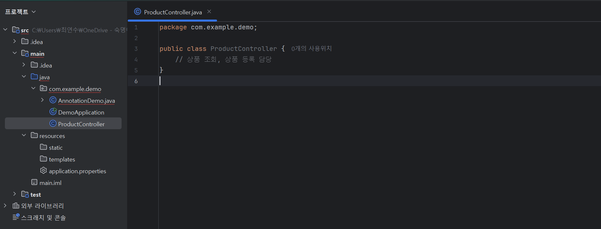
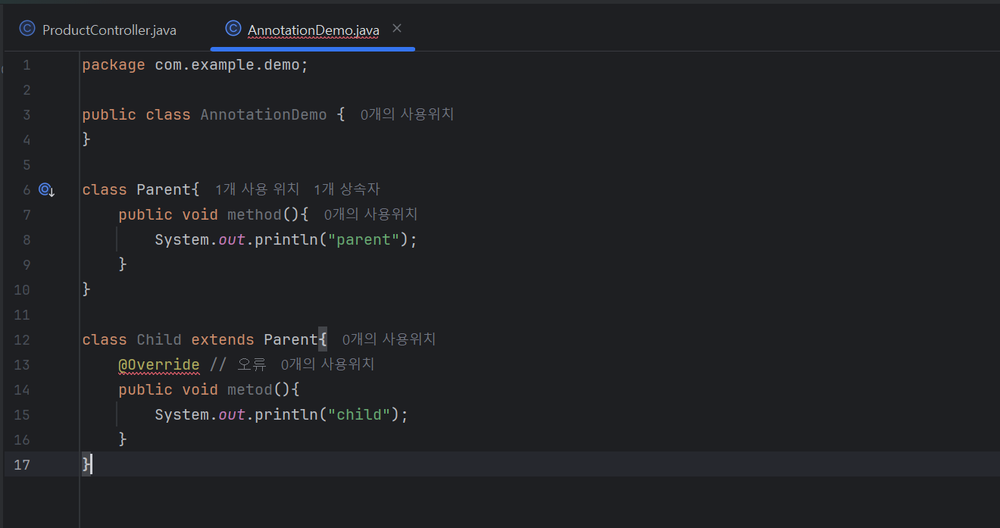

1. ##### **섹션7**

###### Spring MVC(클래스 구조=역할 부여)

* View: 화면/프론트엔드에서 화면을 개발하기 때문에 더이상 하지 않음
* Controller: view와 model의 중간 매개체
* Model: 데이터 연산, 로직/DB와 소통(Repository), 로직(Service)

###### 컨트롤러 생성

demo 폴더 안에 있는 com.example.demo 파일 안에 기능을 담은 컨트롤러명인 ProductController 생성

###### 스프링에게 말을 걸 수 있는 방법?

* 자바에서 어노테이션을 제대로 이해해야됨
* 어노테이션은 자바 개념
* 어노테이션의 역할
1. 컴파일러에게 알려주기 ex)@Override
2. 빌드 도구에게 알려주기 ex)@Getter
3. 프레임워크에게 알려주기 ex)@스프링에게 자신을 아래 클래스를 스프링빈으로 관리해달라고 함

