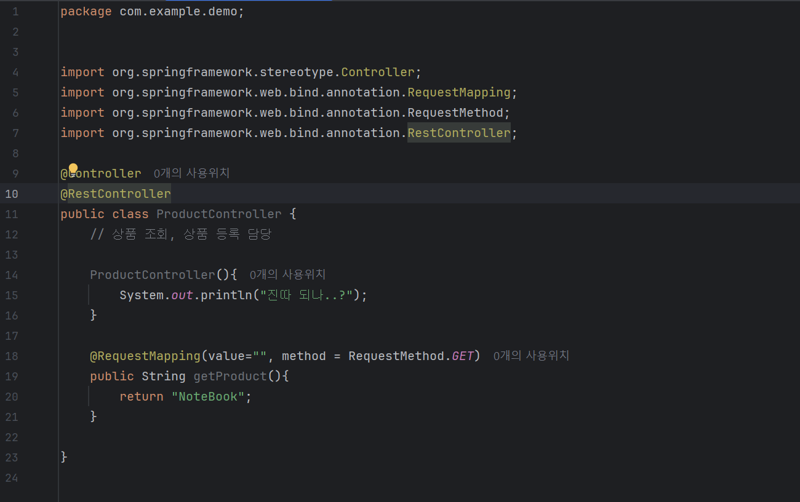
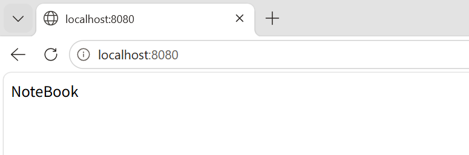

###### **@RequestMapping()**

: 사용자의 요청이 날아오면 아래 메소드 호출

: 괄호 안에 http에 대한 내용 넣음

###### **HTTP**

Request(요청)

\-URL(주소)

\-Method(목적) ex.조회, 삽입, 수정...

1. 조회: GET
2. 등록/생성/삽입: POST
3. 수정: (전체)PUT/(부분)PATCH
4. 삭제: DELETE

Response(응답)

\-Body: 데이터

RestController는 @Controller(옛날 컨트롤러)와 @ResponseBody의 조합

