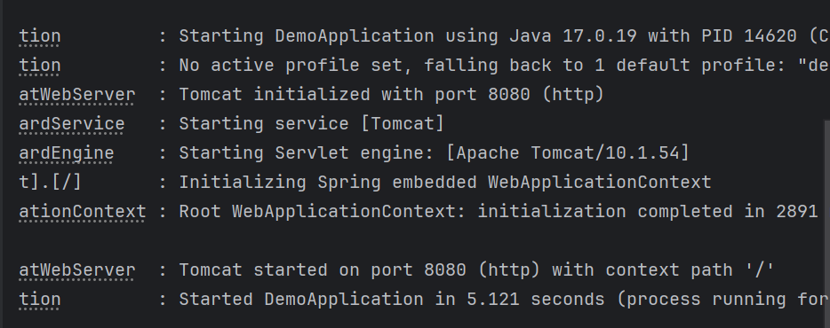
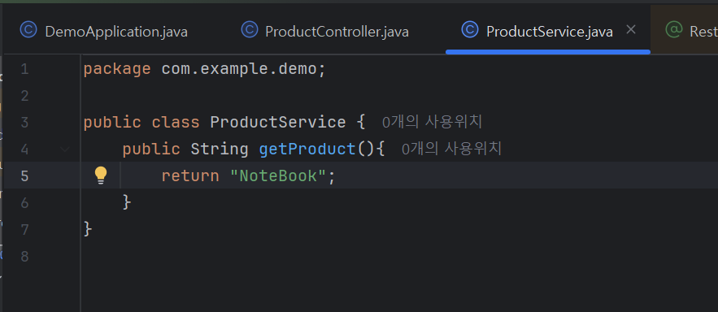
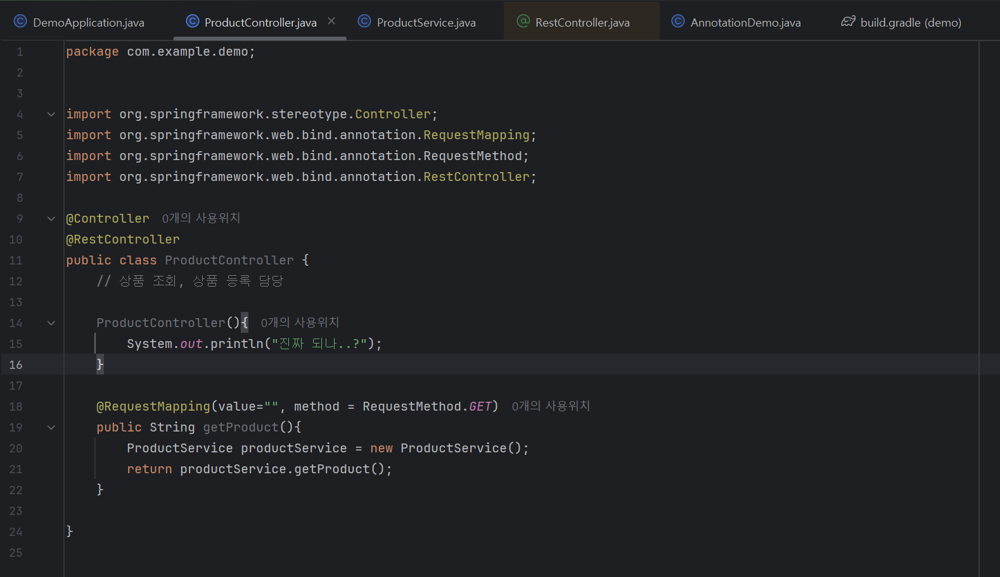
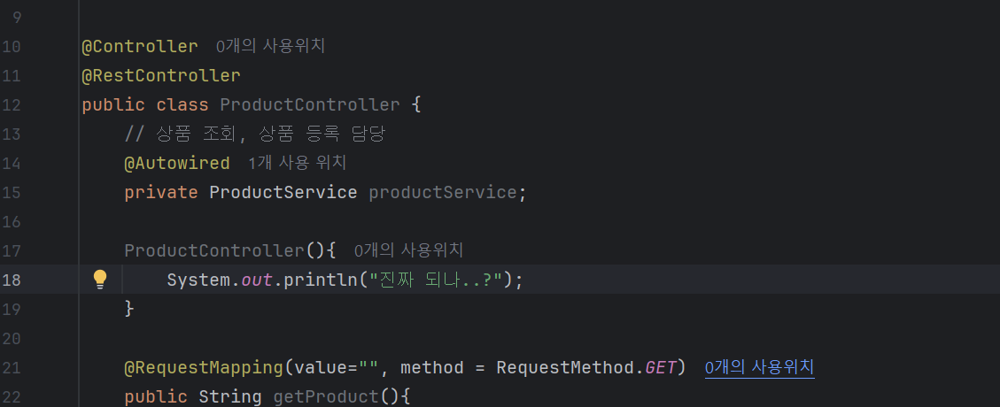
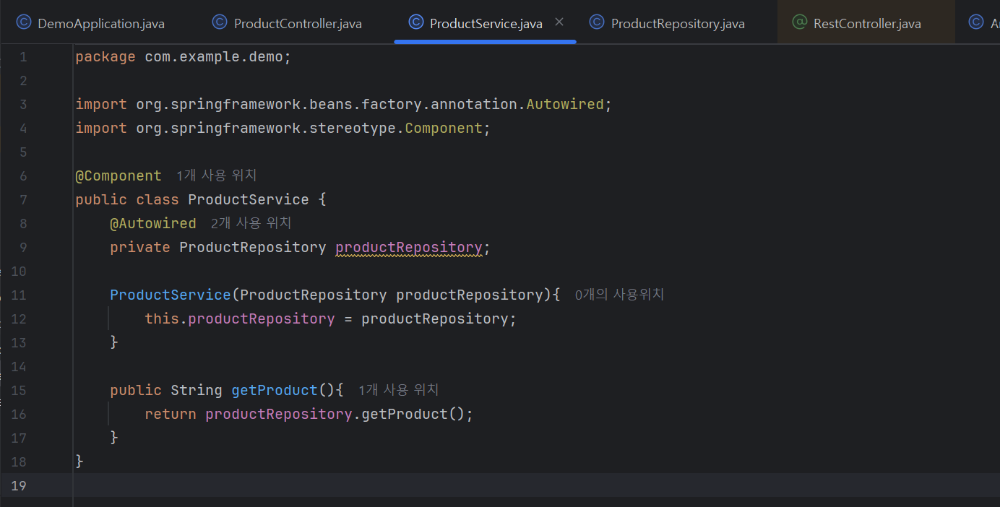

Model
Repository-데이터를 가지고 연산/처리
Service-데이터 관리/소통

스코프 제한, 메모리 낭비문제를 해결하고 코드를 효율적으로 관리하기 위해 @Autowired 사용
-객체 재사용:객체를 하나만 생성해서 컨테이너에 보관
-어디서든 공유 가능: 필드나 생성자에 선언해두면, 스프링이 미리 만들어둔 하나의 객체를 가져와서 연셜
-메모리 절약: 기존 객체를 재사용해서 서버 성능이 좋아짐

DI방법 3가지
1. @Autowired //세터 주입 방식
    public void set***
2. @Autowired// 필드 주입 방식
    private
3. @Autowired //생성자 주입

    
