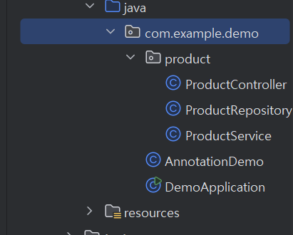
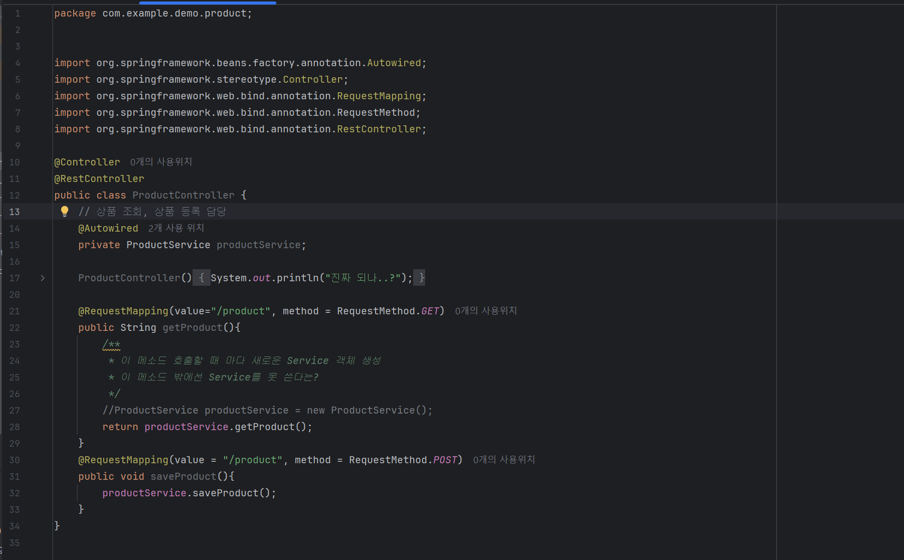
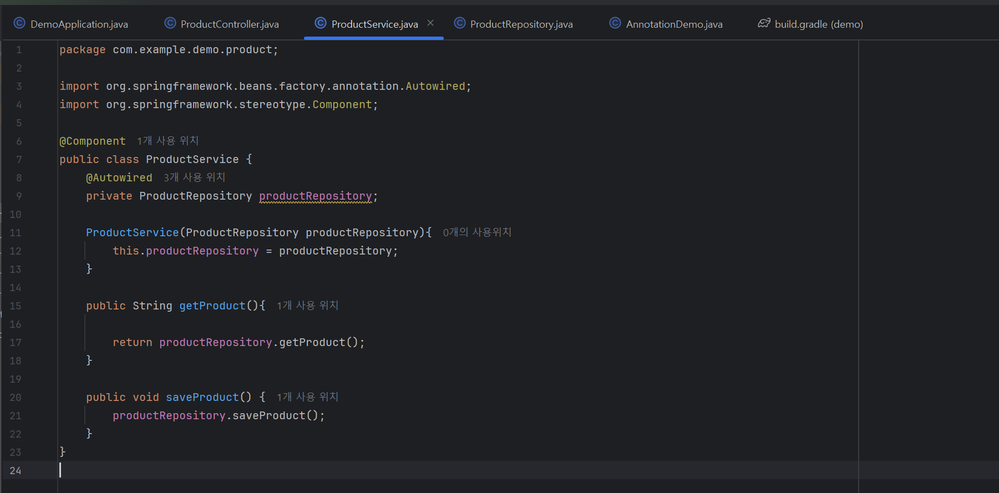
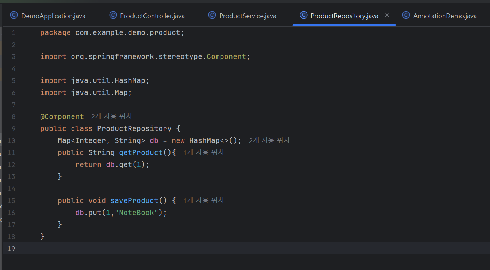

DDD(Domain Driven Development)
: 사용자가 원하는 요구사항 -> 제공하는 "기능의 덩어리"
ex) 쇼핑몰: 회원가입, 로그인, 마이페이지..=> 회원 서비스
            상품조회, 상품 등록, 상품 삭제...=> 상품 서비스

*product
->ProductController
->ProductService
->ProductRepository

 Rest API URL 설계 규칙
 *http://localhost:8080

 *상품조회(method=GET)
 http://localhost:8080/product

*상품등록(method=POST)
 http://localhost:8080/product

 /: ~의, ~중에
 
 
 